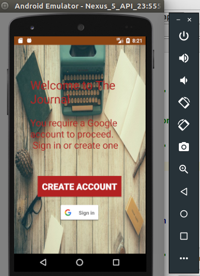
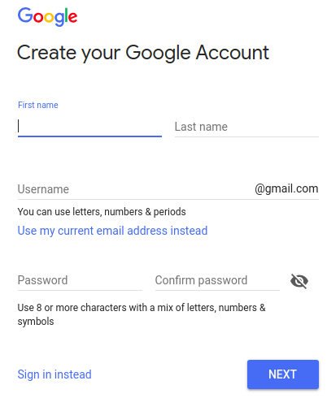
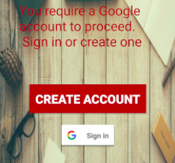
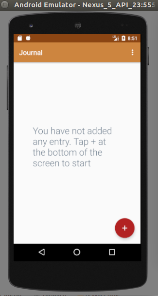
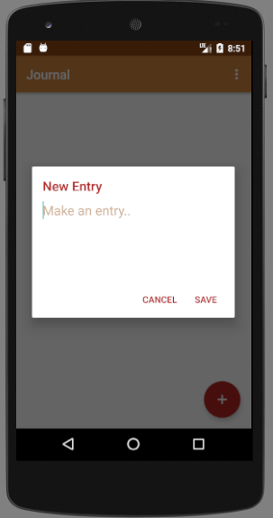
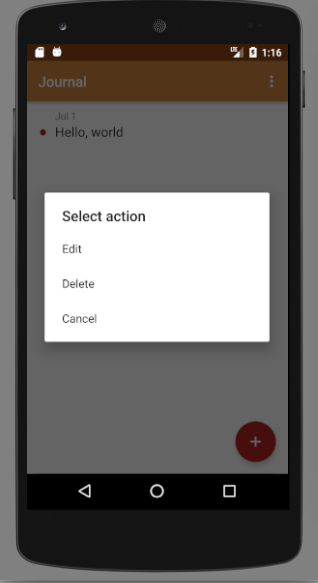
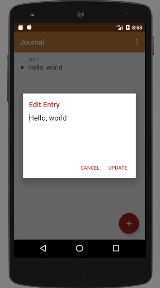
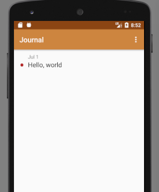
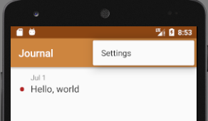
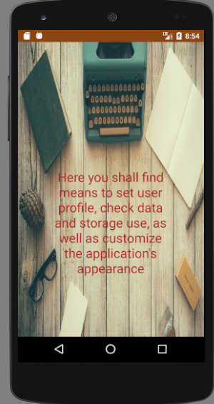

# My Journal App
  
ALCWithGoogle3-slack 
Profile name: <b>BigPictureDisciple<b/>
   
This is my attempt at the 7 Days of code challenge - ALCWithGoogle 3.0 

As per project instructions :-  
 
At minimum users should be able to: 
 1.Register and Login using google authentication. 
 2.View all entries to their diary. 
 3.View the contents of a diary entry. 
 4.Add and modify an entry.  
I affirm that feature 1 is <b>INCOMPLETE</b>. 
 
 
Minimal implementation: 
User is requested to sign-in via the SIGN-IN button, using 
a Google account.If none exists,user may tap on CREATE ACCOUNT button, and is redirected to Google's 
account creation page. 
  

 
After creating a Google account, user may return
to app and sign-in via the Google sign-in button
 
 
  
After successful authentication, user is brought to the "Home screen". 
This will be empty, for new users(or if no entries have been saved). 
 
 
User is prompted to add entries on empty screen
  

 
NOTE: This feature is incomplete, as there is NO AUTHENTICATION feature
set.
 
  
Dialog box gives user means of adding journal entry and saving it 

 
Entries are modifiable(Edit/Delete) 
<b>LONG PRESS<b/> on the entry to call up "Select Action" menu 
 
 
 
 

Entries are displayed 
 

There's a settings option intended 
 

User may customize app appearance(un-implemented) 
 

Over all, I concede that I was unable to successfully meet all the minimum requirements within the afforded time.
 
I utilize SQLite3 for the app, however I must state that I'd looked into using Firebase. 
